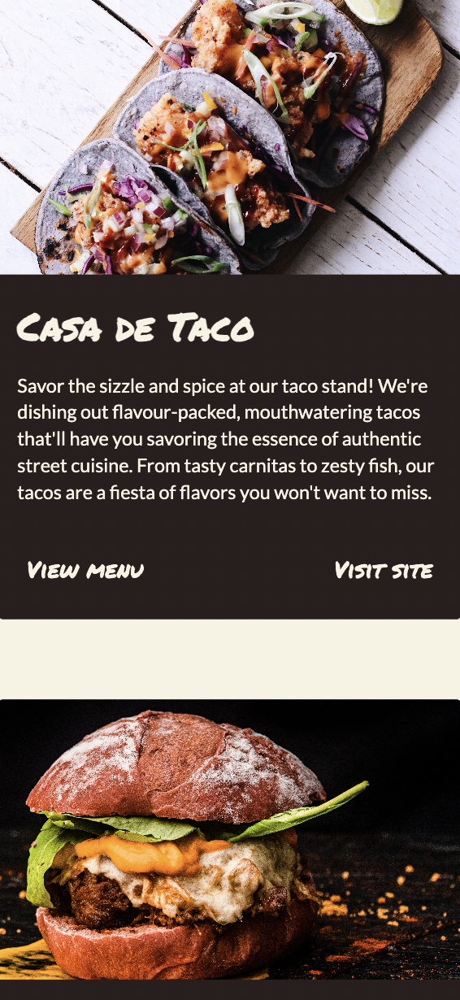
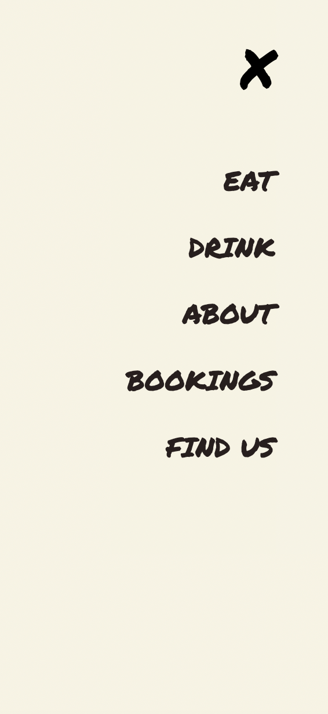
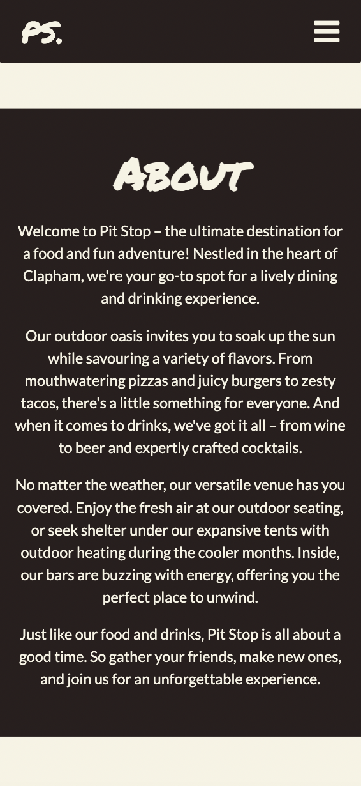
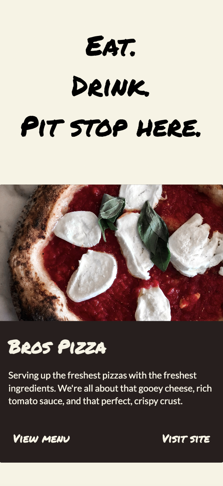
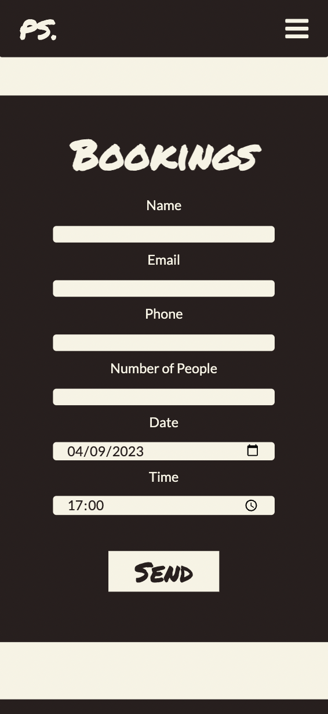
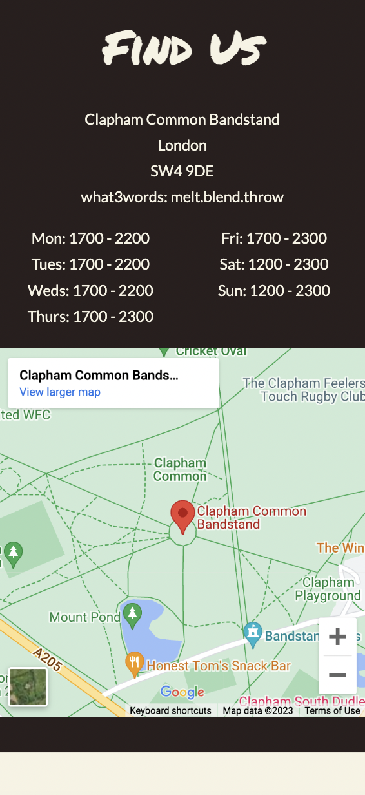

# PIT STOP

Landing page design for ficitonal London street food market with multiple vendors. 

Goal is to design and build out individual landing page for each vendor.

:round_pushpin: [wwww.pitstop.com](https://main--stirring-bunny-e3e887.netlify.app/)

<section>
   
</section>

 
 

<section align=center>

 

 

 

</section>
